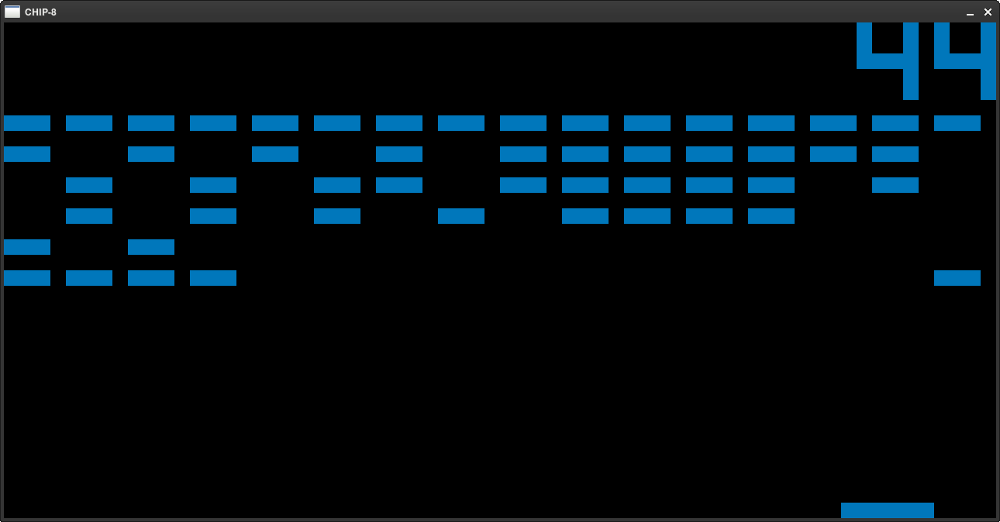
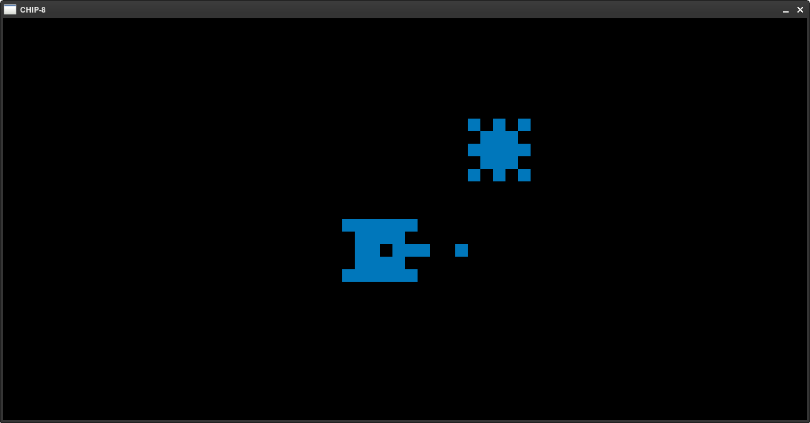
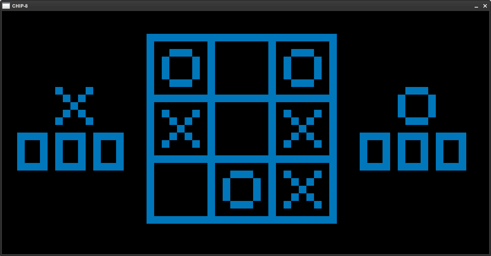

# Chip 8 Package - Emulator & Assembler
Within this repo, there exist both a complete CHIP-8 Emulator(Interpreter) as well as a assembler for an assembly 
language based on [Cowgods CHIP-8 Reference](http://devernay.free.fr/hacks/chip8/C8TECH10.HTM#1nnn).

Both the Emulator and Assembler are written from scratch entirely in C++. Detailed information regarding both projects
can be found in the README of their respective folders. 

ROMS for tons of CHIP-8 games can be found .

### Pictures

Brick Breaker

Tanks Game

Tic Tac Toe!

